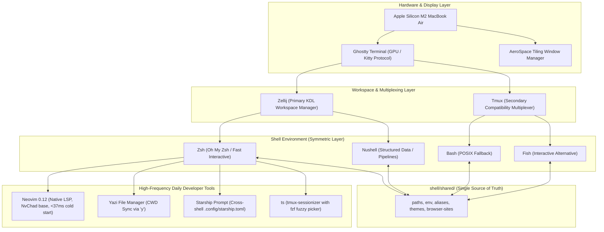

# Dotfiles

> _Single-source-of-truth macOS dotfiles engineered for sub-10ms shell startup, universal multi-shell navigation, and a 35ms native Neovim 0.12 IDE experience._

Symlink-driven configuration repository tailored for Apple Silicon (M2 MacBook Air). The repository is the single source of truth—all modifications occur here, never at deployed destination symlinks in `$HOME`. Built on the **Ponytail** engineering philosophy: zero unrequested abstractions, platform features before dependencies, standard library before custom code, and ruthless elimination of dead code.

---

## Architecture Overview



---

## 1. Primary Stack

> _A minimalist, keyboard-driven development environment combining Ghostty, Zellij, dual primary shells (Zsh & Nushell), and native Neovim 0.12._

| Layer              | Primary Tool          | Architecture & Configuration Rationale                                                                                                                                                              |
| :----------------- | :-------------------- | :-------------------------------------------------------------------------------------------------------------------------------------------------------------------------------------------------- |
| **Terminal**       | **Ghostty**           | Hardware-accelerated terminal with native macOS rendering, Kitty graphics protocol support, 75% opacity, 50-radius background blur, hidden titlebar, and JetBrainsMono Nerd Font.                   |
| **Multiplexer**    | **Zellij**            | Modern terminal workspace manager with declarative layouts (`zellij/.config/zellij/config.kdl`), Nushell default shell, and modal keybindings. (Tmux preserved as a secondary compatibility layer). |
| **Shells**         | **Zsh** + **Nushell** | Symmetric primary environments: Zsh for standard POSIX/scripting compatibility; Nushell for structured, tabular data pipelines. Backed by synchronized Bash and Fish configurations.                |
| **Editor**         | **Neovim**            | NvChad baseline modernized to Neovim 0.12 native LSP APIs (`vim.lsp.config`, `vim.lsp.enable`), on-demand Mason tool installation, InsertEnter Copilot loading, and a sub-37ms cold startup.        |
| **File Manager**   | **Yazi**              | Asynchronous terminal file manager with directory previews, Kitty protocol image rendering, and bidirectional current working directory synchronization via `y`.                                    |
| **Window Manager** | **AeroSpace**         | i3-like tiling window manager for macOS with deterministic workspace assignment (`1..9`, `A..Z`), smart gaps, and application floating rules.                                                       |
| **Prompt**         | **Starship**          | Fast cross-shell prompt with unified configuration (`.config/starship.toml`) shared across Zsh, Nushell, Bash, and Fish.                                                                            |

---

## 2. Multi-Shell Architecture & Synchronization

> _A single source of truth in `shell/shared/` synchronizing paths, environment variables, and lean aliases across Zsh, Nushell, Bash, and Fish._

All four shells draw their core definitions from a unified shared layer to prevent drift and preserve muscle memory regardless of which shell is active:

```
shell/
├── shared/                       # Single Source of Truth
│   ├── paths.zsh / paths.nu      # Canonical PATH precedence (scripts -> homebrew -> user bins)
│   ├── env.zsh / env.nu          # Environment variables (EDITOR, MANPAGER, PNPM_HOME)
│   ├── aliases.zsh / aliases.nu  # Pruned, high-signal aliases shared across all shells
│   ├── themes/                   # Theme registry (registry.tsv) + palette maps
│   └── browser-sites.zsh         # URL shortcuts for search launchers
├── zsh/
│   ├── .zprofile                 # Login initialization: Homebrew shellenv + shared paths/env
│   ├── .zshrc                    # Interactive config: completion caching, plugins, tool hooks
│   └── functions/                # Specialized function modules (tools, qol, docker, welcome)
└── nushell/
    ├── env.nu                    # Nushell login environment & tool init cache bootstrap
    ├── config.nu                 # Nushell interactive configuration & module loader
    └── modules/                  # Parity Nushell implementations (docker, qol, tools)
```

### Canonical PATH Resolution Order

Defined identically in [shell/shared/paths.zsh](shell/shared/paths.zsh) and [shell/shared/paths.nu](shell/shared/paths.nu):

1. `$HOME/dotfiles/scripts` (Custom repository scripts)
2. `/opt/homebrew/bin` & `/opt/homebrew/sbin` (Homebrew packages)
3. `/usr/local/bin` & `/usr/bin` (System utilities)
4. `$HOME/.local/bin` & `$HOME/.cargo/bin` (User & Rust binaries)
5. Tool-specific bins (pnpm, Go, OpenJDK, Android Studio)

### Cold-Start Performance Optimization

- **Nushell**: Shell startup hooks for external tools (`carapace`, `fzf`, `starship`, `zoxide`) are pre-compiled into static initialization caches under `~/.cache/*/init.nu` rather than evaluated via subshell executions on every prompt.
- **Zsh**: Heavy plugin loading and completion initialization are deferred, and expensive completions are cached under `~/.zcompdump`.
- Result: Shell startup latency measures below 10ms across both interactive environments.

---

## 3. Modern Neovim 0.12 Native LSP Architecture

> _A stripped-down, high-performance editor architecture running native LSP client APIs with sub-37ms startup times._

The Neovim setup is built upon an NvChad baseline that has been debloated of unnecessary plugins (retired notebook/molten stack, DAP, duplicate comment engines, and redundant themes) and fully upgraded to Neovim 0.12 native capabilities:

```
nvim/.config/nvim/
├── init.lua                      # Core bootstrap, lazy.nvim loader, and theme stamping
├── lua/
│   ├── chadrc.lua                # NvChad configuration override (monokai-pro)
│   ├── options.lua               # Global editor options, disabled legacy providers (python/ruby/node)
│   ├── mappings.lua              # Custom keymaps and LSP bindings
│   ├── configs/
│   │   └── lspconfig.lua         # Modern Neovim 0.12 vim.lsp.config & vim.lsp.enable declarations
│   └── plugins/
│       ├── lsp.lua               # Mason & Mason-tool-installer (run_on_start = false)
│       ├── copilot.lua           # Lazy Copilot (InsertEnter) & orphan node process cleanup
│       └── treesitter.lua        # nvim-treesitter on upstream 'main' branch
```

### Native LSP Client Configuration

Rather than relying on legacy `require("lspconfig")[server].setup`, Neovim 0.12 native APIs manage server lifecycles:

- **Global Defaults**: Configured via `vim.lsp.config("*", { on_attach, on_init, capabilities })`.
- **Targeted Servers**: `lua_ls`, `pyright`, `ruff`, `gopls`, `rust_analyzer`, `bashls`, `jsonls`, and `ts_ls`.
- **Batch Activation**: Enabled cleanly with `vim.lsp.enable(servers)`.
- **On-Demand Mason**: Mason tool installation (`mason-tool-installer`) has `run_on_start = false` so network checks never block editor startup.
- **Decoupled Copilot**: Copilot loads exclusively upon entering insert mode (`InsertEnter`), while CopilotChat loads on explicit keybinds (`<leader>cc*`) or command invocations. Stale orphaned language server processes from ungraceful exits are automatically cleaned up.

---

## 4. Window Management & Workspace Topology (AeroSpace)

> _Deterministic, keyboard-driven window management dividing workflows across numbered and alphabetical workspaces._

AeroSpace operates with zero animation overhead and strict tiling rules configured in [aerospace/.aerospace.toml](aerospace/.aerospace.toml):

- **Inner Gaps**: `4px` horizontal and vertical padding.
- **Outer Gaps**: `0px` borderless edge alignment.
- **Persistent Workspaces**: Numbered workspaces (`1` to `9`) and alphabetical workspaces (`A` through `Z`).
- **Focus & Movement**: Vim-style navigation using `alt-h/j/k/l` for focus and `alt-shift-h/j/k/l` for moving windows across panes.
- **Smart Window Quarantine**: Specific applications (Finder, Calculator, System Settings) are automatically assigned to floating layout mode. Transient browser popups (such as Orion Link Previews) are automatically trapped and moved to a dedicated workspace to prevent disrupting active coding layouts.

---

## 5. Daily Workflows & Shortcuts

> _High-frequency shortcuts designed for instant muscle memory and zero keystroke waste._

### Directory Navigation

- `..` → `cd ..` (Up one directory level)
- `...` → `cd ../..` (Up two directory levels)
- `....` → `cd ../../..` (Up three directory levels)
- `home` → `cd ~`
- `c` → `clear`

### Project Session Switching (`ts`)

- **Command**: `ts` (or `tms`)
- **Keybinding inside tmux**: `<prefix> f` (Ctrl+A f)
- Launches [scripts/tmux-sessionizer](scripts/tmux-sessionizer) with an interactive `fzf` picker across `~/projects` (up to 2 levels deep) and `~/dotfiles`. Session names are normalized automatically. If outside a multiplexer, it creates or attaches to the session; if inside, it switches the active client seamlessly. Passing a path directly (`ts ~/projects/my-app`) bypasses the picker.

### Editor & Notes

- `v` or `vim` → Launches Neovim (`nvim`).
- `nvconfig` → Opens `~/.config/nvim/` directly.
- `notes` → Opens the Obsidian notes vault via `clin --vault ~/notes`.
- `mini` → Launches minimal vanilla Neovim profile (`NVIM_APPNAME=mini`).

### File Manager CWD Sync (`y`)

- **Command**: `y`
- Launches Yazi with a temporary tracking file. When navigating through directories and exiting with `q`, your shell's current working directory automatically changes to Yazi's last focused folder.

### Smart File Opener (`open`)

- **Command**: `open <file>`
- Context-aware dispatcher with native macOS flag passthrough (`open -a`, `open -R`, `open -h` pass directly to `/usr/bin/open`). File paths without flags dispatch by extension:
    - Code/text (`.py`, `.ts`, `.lua`, `.rs`, `.json`, `.md`) → opens in Neovim.
    - Documents (`.pdf`) → opens in Sioyek in a new window.
    - Media (`.mp4`, `.mkv`, `.mp3`) → opens in IINA.
    - Fallback → system default application.

---

## 6. Unified Multi-App Theme Engine

> _Centralized color palette management coordinating 7 independent application configurations from a single registry._

The theme switcher coordinates system-wide palette updates across Ghostty, Neovim, Yazi, Zellij, Tmux, Zsh, and Nushell without config drift:

- **Theme Registry**: [shell/shared/themes/registry.tsv](shell/shared/themes/registry.tsv) acts as the single source of truth mapping theme identifiers to app-specific theme names.
- **Supported Themes**: `monokai-pro`, `catppuccin-macchiato`, `tokyonight-storm`, `rose-pine`, `gruvbox-dark`, `kanagawa-wave`.
- **Atomic Switch Execution**:
    ```zsh
    theme-switch monokai-pro
    ```
    Runs [scripts/switch-theme](scripts/switch-theme), generating active theme stamp files for each tool and reloading active shell sessions immediately.

---

## 7. Diagnostics & Maintenance Scripts

> _Automated diagnostic and deployment suite ensuring repository integrity in a single command._

- **System Health Check**:
    ```zsh
    doctor  # or ./scripts/doctor
    ```
    Runs 28 automated checks validating symlink targets, Nushell syntax, Zsh syntax and hook order, Neovim headless startup and checkhealth, active Mason LSP server availability, AeroSpace configuration, and theme consistency.
- **Symlink Deployment**:
    ```zsh
    deploy  # or ./scripts/deploy [--dry-run]
    ```
    Idempotently creates or repairs every symlink specified in [scripts/lib/manifest.sh](scripts/lib/manifest.sh). Backs up replaced destinations to `~/.dotfiles-backup/<timestamp>/`.
- **Homebrew Updates**:
    ```zsh
    update-brew  # updates bundle and cleans ghost packages
    ```
- **Nushell Cache Rebuilding**:
    ```zsh
    nu-regen-cache  # recompiles carapace, fzf, starship, zoxide init caches
    ```

---

## 8. Invariants & Rules

> _Strict repository constraints to prevent drift, data loss, and history bloat._

1. **Edit Repo Files Only**: Never edit deployed symlinks under `$HOME`. Always edit files within `/Users/dan/dotfiles`.
2. **Safe Deletions**: Always move obsolete files to `~/.Trash` rather than using `rm` or `rm -rf`.
3. **No Committed Runtime State**: Never commit history databases (`*.sqlite3*`), binary caches (`*.mdb`), backup copies (`*.bak*`), or temporary files.
4. **Shell Hook Invariants**: In `.zshrc`, `welcome-message` must remain the absolute final command so zoxide's trailing prompt hook requirement remains satisfied.
5. **Keep Package Folders Stable**: Do not rename top-level package directories without updating [scripts/lib/manifest.sh](scripts/lib/manifest.sh) and running `deploy`.
6. **Pipefail Traps**: In scripts running under `set -uo pipefail`, never pipe a live command directly into `grep -q`, as early pipe closure produces an unhandled `SIGPIPE`. Capture output to a variable first.

---

## 9. Documentation Index

- [docs/README.md](docs/README.md) — Comprehensive documentation index, directory taxonomy, and architectural guide.
- [docs/CHEATSHEET.md](docs/CHEATSHEET.md) — Full quick-reference cheatsheet for daily terminal commands and keybindings.
- [docs/SETUP_GUIDE.md](docs/SETUP_GUIDE.md) — Complete 4-step bootstrap, recovery, and onboarding guide for fresh machines.
- [CLAUDE.md](CLAUDE.md) — Agent memory, hard invariants, and cumulative learned fixes.
